# 🧠 MemoryVerse AI

### Intelligent Digital Identity System

> Transforming scattered academic and professional documents into an organized, searchable, and intelligent digital identity.


---

# 📖 Overview

MemoryVerse AI is a modern web-based Digital Identity System designed to help students organize, manage, and access their academic and professional journey from a single platform.

Students accumulate resumes, certificates, internship letters, project reports, portfolios, achievements, and learning records throughout their education. Managing these documents across folders, cloud drives, and emails becomes increasingly difficult over time.

MemoryVerse AI provides a centralized platform that simplifies document management through an intuitive dashboard, organized storage, visual analytics, and intelligent navigation, enabling users to maintain a structured digital identity.

---

# 🎯 Problem Statement

Academic and professional documents are often scattered across multiple storage locations, making retrieval difficult and time-consuming.

MemoryVerse AI addresses this challenge by providing a centralized digital identity platform where users can securely organize, manage, and access their important documents through a modern and user-friendly interface.

---

# ✨ Key Features

## 🔐 Authentication

- Secure Login & Registration
- User Authentication
- Session Management

---

## 📂 Document Management

- Upload Documents
- Organize Files
- Document Library
- Easy Access

---

## 📊 Dashboard

- Modern Dashboard
- Quick Navigation
- User Statistics
- Activity Overview

---

## 🔍 Smart Search

- Search Documents
- Organized Results
- Quick Retrieval

---

## 🕸 Knowledge Graph

- Visual document relationship interface
- Connected information representation

---

## 📅 Digital Timeline

- Chronological journey visualization
- Academic and professional milestones

---

## 🤖 AI Assistant Interface

- Dedicated AI assistant page
- Modern chat interface
- Interactive UI

---

## 📈 Analytics

- Dashboard Analytics
- Visual Charts
- Document Statistics

---

## 👤 Profile Management

- Update User Information
- Manage Personal Profile

---

## ⚙ Settings

- User Preferences
- Account Settings

---

## 📄 Resume Builder

- Resume Builder Interface
- Professional Resume Layout

---

# 🖼 Project Preview

## Landing Page

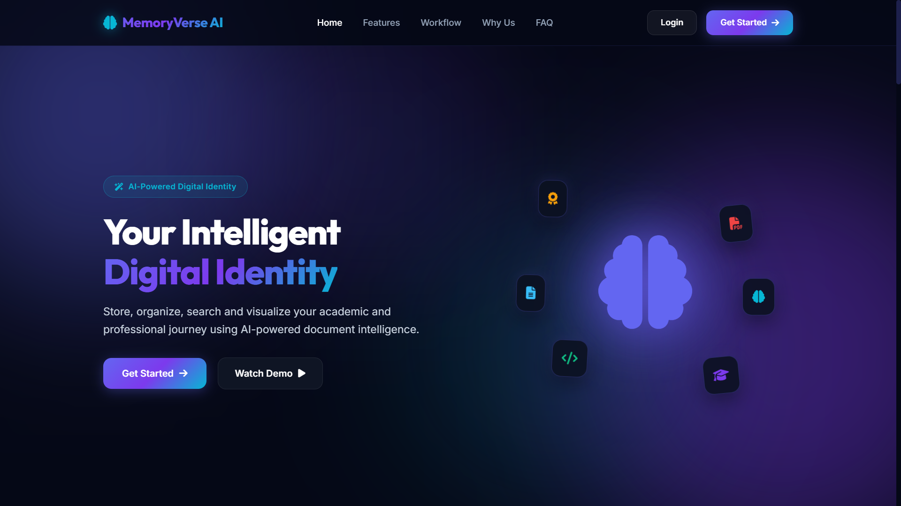

---

## Dashboard

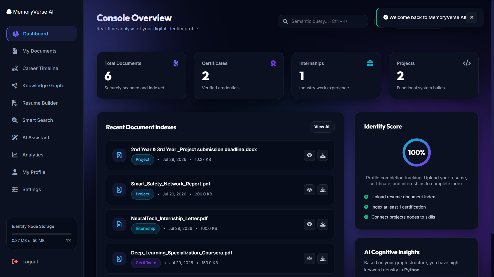

---

# 🏗 System Architecture

The application follows a modular Flask architecture for scalability and maintainability.

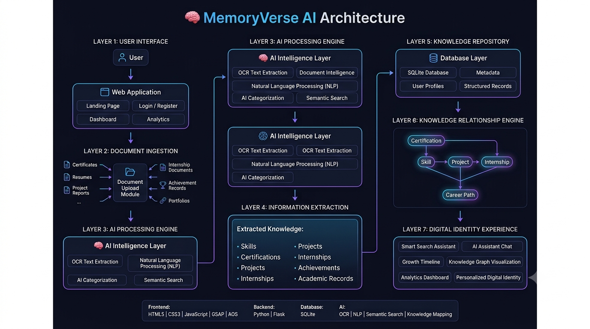

---

# 💻 Technology Stack

| Category | Technologies |
|-----------|--------------|
| Frontend | HTML5, CSS3, JavaScript |
| Backend | Python, Flask |
| Database | SQLite |
| Template Engine | Jinja2 |
| Styling | CSS3 |
| Version Control | Git & GitHub |

---

# 📁 Project Structure

```
MemoryVerse-AI/
│
├── database/
├── models/
├── routes/
├── screenshots/
├── static/
│   ├── css/
│   ├── js/
│   └── images/
│
├── templates/
│
├── app.py
├── config.py
├── extensions.py
├── requirements.txt
├── Procfile
├── system-architecture.png
└── README.md
```

---

# 📸 Application Screenshots

## 🏠 Landing Page


---

## 🔑 Login

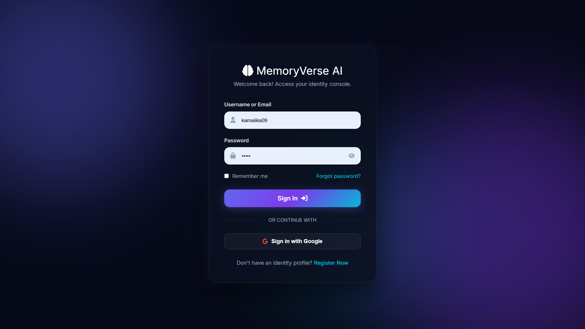

---

## 📝 Register

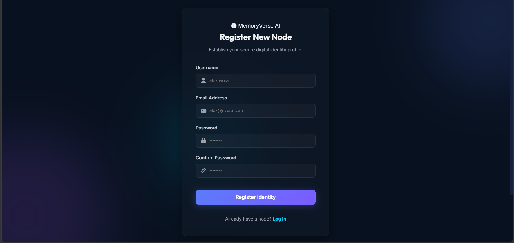

---

## 📊 Dashboard


---

## 📂 Document Management

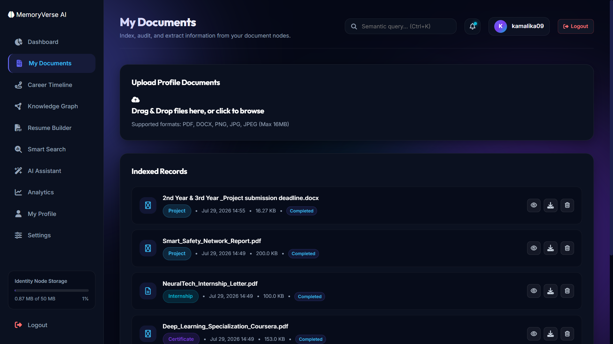

---

## 🕸 Knowledge Graph

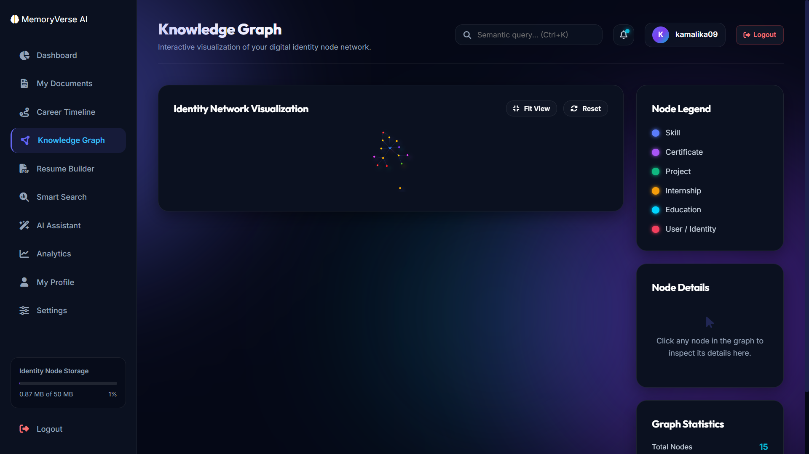

---

## 📅 Timeline

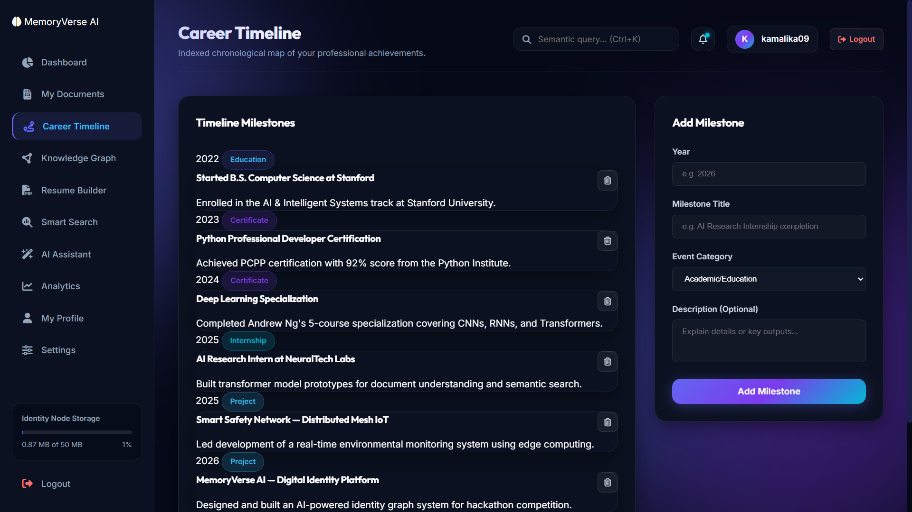

---

## 🔍 Smart Search

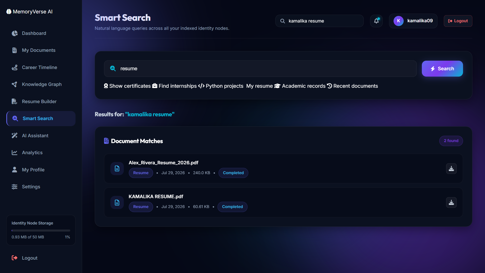

---

## 📈 Analytics

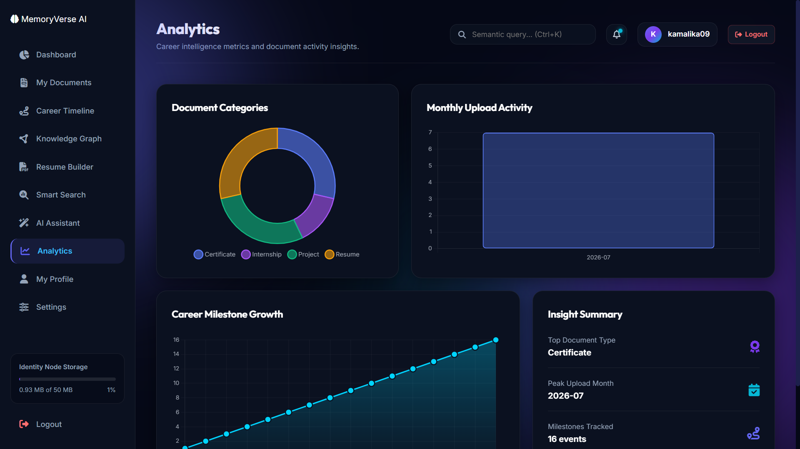

---

## 🤖 AI Assistant

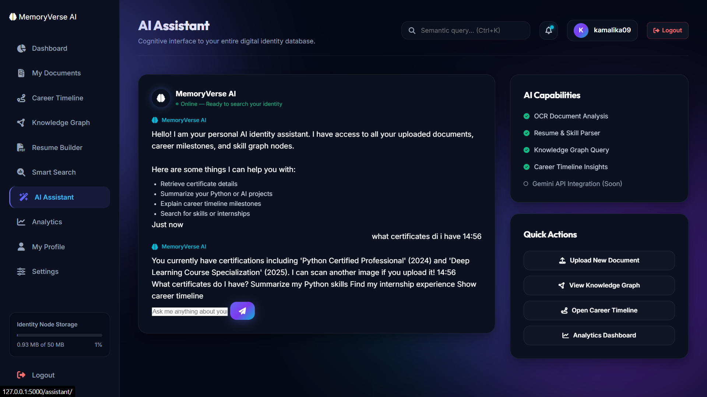

---

## 📄 Resume Builder

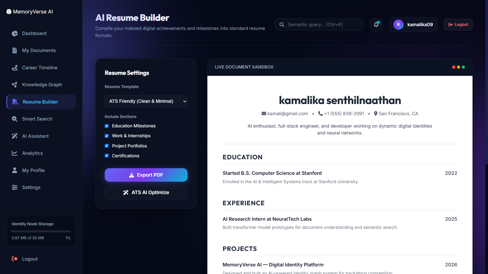

---

## 👤 Profile

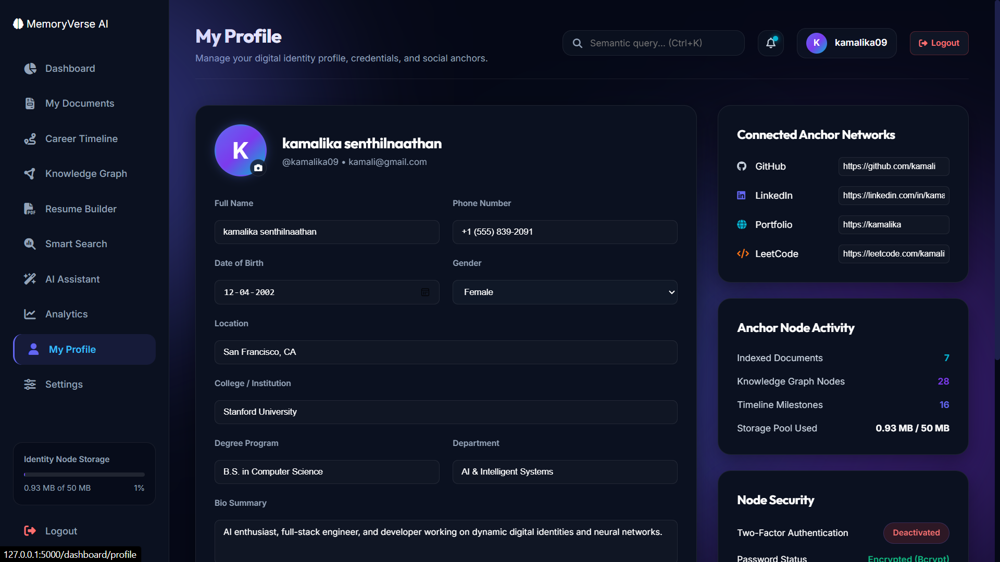

---

## ⚙ Settings

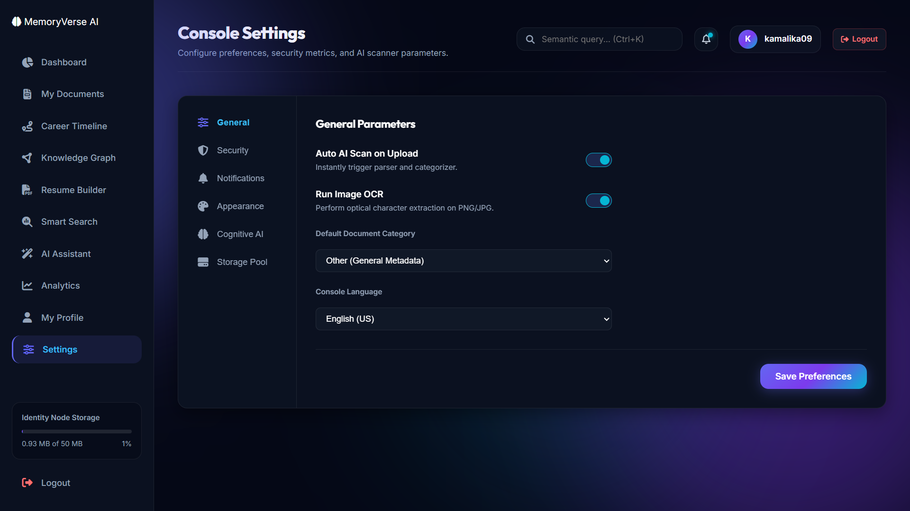

---

# ⚙ Installation

## Clone Repository

```bash
git clone https://github.com/kamalikasenthilnaathan09/MemoryVerse-AI.git
```

## Navigate to Project

```bash
cd MemoryVerse-AI
```

## Create Virtual Environment

```bash
python -m venv venv
```

## Activate Virtual Environment

### Windows

```bash
venv\Scripts\activate
```

### Linux / macOS

```bash
source venv/bin/activate
```

---

## Install Dependencies

```bash
pip install -r requirements.txt
```

---

## Run Application

```bash
python app.py
```

Open your browser:

```
http://127.0.0.1:5000
```

---

# 🚀 Future Roadmap

The current prototype establishes the core platform for document management and digital identity. Future enhancements may include:

- OCR-based document text extraction
- AI-powered document categorization
- Semantic document search
- Resume parsing
- Knowledge graph automation
- Embedding-based document retrieval
- RAG-powered AI assistant
- Cloud storage integration
- Mobile application support
- Voice-enabled search
- AI-generated document summaries

---

# 🏆 Hackathon Submission

This project was developed as part of the **MemoryVerse AI '26 Hackathon**, with the objective of creating an intelligent Digital Identity System that helps students manage their academic and professional documents through a modern web platform.

---

# 👩‍💻 Developer

**Y. S. Kamalika**

**B.Tech – Artificial Intelligence & Data Science**

GitHub: https://github.com/kamalikasenthilnaathan09

---

# 🤝 Contributing

Contributions, suggestions, and feature requests are welcome.

Feel free to fork this repository and submit pull requests for improvements.

---

# 📄 License

This project is intended for educational, learning, and hackathon purposes.

---

<div align="center">

### ⭐ If you found this project useful, consider giving it a Star!

**Thank you for visiting MemoryVerse AI ❤️**

</div>
